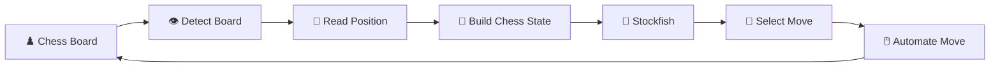

<div align="center">

# ♟️ Chess Auto Bot

### **See the board → Understand the position → Find the move → Automate it**

A Python project exploring the intersection of **Chess ♟️ + Computer Vision 👁️ + Chess Engines 🧠 + Automation ⚙️**

<p>
  
  
  
  
</p>

<p>
  <a href="https://github.com/utkdwivedi/chess-auto-bot">Repository</a>
  ·
  <a href="https://github.com/utkdwivedi/chess-auto-bot/issues">Issues</a>
  ·
  <a href="https://github.com/utkdwivedi/chess-auto-bot/stargazers">Stars</a>
</p>

</div>

---

## 🎮 What is this?

**Chess Auto Bot** is a learning-focused automation project designed around one simple idea:

> **Turn what a human sees on a chessboard into a move a computer can understand and execute.**

The project explores a complete pipeline from **visual board recognition** to **engine analysis** and finally **move automation**.

---

## ⚡ The Pipeline



### In one line

**Detect → Decode → Analyse → Move → Repeat**

---

## ✨ Highlights

<table>
<tr>
<td width="50%">

### 👁️ Computer Vision
Read the chessboard from a visual interface and identify the position.

</td>
<td width="50%">

### 🧠 Engine Analysis
Use **Stockfish** to evaluate the position and choose a strong move.

</td>
</tr>
<tr>
<td width="50%">

### ♟️ Chess Logic
Use chess representations and legal-move handling instead of treating the board as raw pixels.

</td>
<td width="50%">

### ⚙️ Automation
Translate a selected move into screen actions for supported environments.

</td>
</tr>
</table>

---

## 🧩 How the Pieces Fit Together

<details>
<summary><b>👁️ 1. Board Detection</b></summary>

The first challenge is figuring out **where the chessboard is** and extracting useful information from the screen.

</details>

<details>
<summary><b>♟️ 2. Position Reconstruction</b></summary>

The visual information is converted into a machine-readable chess state so that chess logic and an engine can work with it.

</details>

<details>
<summary><b>🧠 3. Stockfish Analysis</b></summary>

Stockfish searches the position and provides an engine-preferred move according to the configured analysis limits.

</details>

<details>
<summary><b>🖱️ 4. Move Automation</b></summary>

The selected move can then be mapped to board coordinates and executed through mouse/keyboard automation where permitted.

</details>

<details>
<summary><b>🔁 5. Continuous Loop</b></summary>

Once the board changes, the process starts again:

```text
Position → Analysis → Move → New Position
```

</details>

---

## 🛠️ Tech Stack

| Tool | Role |
|---|---|
| 🐍 **Python** | Core implementation |
| 👁️ **OpenCV** | Computer vision / image processing |
| ♟️ **python-chess** | Chess rules, board state and move handling |
| 🧠 **Stockfish** | Engine analysis |
| 🖱️ **PyAutoGUI** | Screen interaction / automation |

---

## 🚀 Getting Started

### 1️⃣ Clone

```bash
git clone https://github.com/utkdwivedi/chess-auto-bot.git
cd chess-auto-bot
```

### 2️⃣ Install dependencies

```bash
pip install -r requirements.txt
```

### 3️⃣ Configure Stockfish

Point the project to your local Stockfish executable:

```python
STOCKFISH_PATH = "path/to/stockfish"
```

### 4️⃣ Run

```bash
python main.py
```

> **Note:** The implementation is still evolving, so filenames and configuration may change as the project grows.

---

## 📊 Engine Tuning

You can experiment with the analysis settings:

```python
ENGINE_DEPTH = 15
TIME_LIMIT = 1.0
```

Think of it like this:

**More search → stronger analysis → more computation time**

---

## 🔬 What I'm Learning Through This

This project is mainly about understanding how different systems can work together:

```text
Computer Vision
      +
Chess Representation
      +
Chess Engine
      +
GUI Automation
      ↓
End-to-End Automation System
```

---

## 🗺️ Roadmap

- [ ] Reliable board detection
- [ ] Better piece recognition
- [ ] Automatic board calibration
- [ ] Robust move-coordinate mapping
- [ ] Better handling of animations/transitions
- [ ] Error recovery
- [ ] Game recording & statistics
- [ ] Automated tests
- [ ] Cleaner modular architecture

---

## 🤝 Contributing

Ideas, improvements and bug fixes are welcome.

Open an **Issue** for a bug or feature request, or submit a **Pull Request** with your changes.

---

## ⚠️ Responsible Use

This project is for **education, experimentation, and environments where automation is permitted**.

Do not use automated move execution to gain an unfair advantage on online chess platforms. Always follow the rules of the platform or application you are using.

---

## 👨‍💻 Author

<div align="center">

### **Utkarsh Dwivedi**

[](https://github.com/utkdwivedi)

</div>

---

<div align="center">

### ♟️ **Think. Analyse. Move. Automate.**

⭐ Star the repository if you like the idea.

</div>
